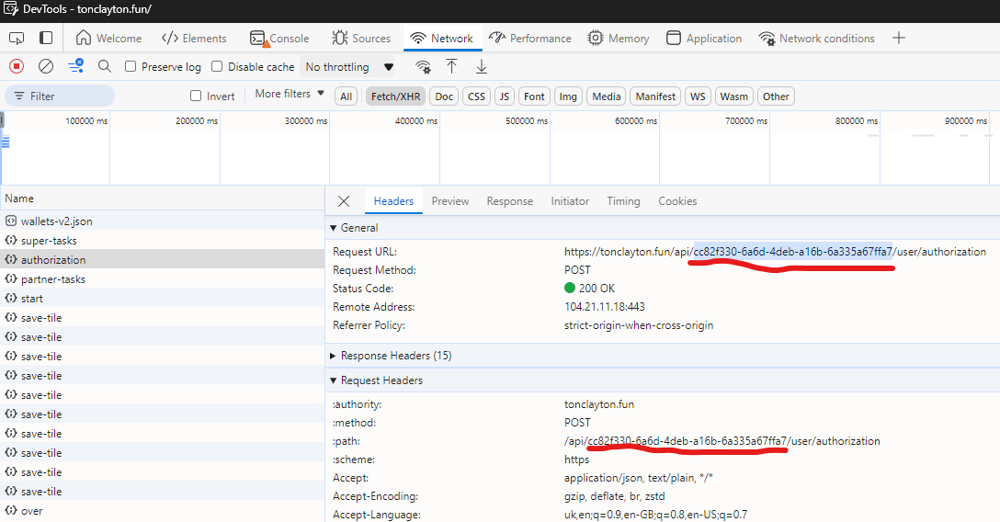

# ClaytonBot

| ✅ | Feature                     |
|----|-----------------------------|
| ✅ | Automates playing a game 1024 |
| ✅ | Performs daily tasks         |
| ✅ | Performs partner tasks         |
| ✅ | Performs other task         |
| ✅ | Daily check                 |
| ✅ | Multiple accounts            |
| ✅ | Proxy            |

## For suggestions or to report a bug, please contact here [telegram](https://t.me/tor_dev)

## Installation

1. Clone the repository:
   - Open your terminal or command prompt.
   - Navigate to the directory where you want to install the bot.
   - Run the following command:
     ```
     git clone https://github.com/TOR968/ClaytonBot.git
     ```
   - This will create a new directory named `ClaytonBot` with the project files.

2. Navigate to the project directory:
   - Change into the newly created directory:
     ```
     cd ClaytonBot
     ```

3. Install the required dependencies:
   ```
   npm install
   ```

4. Open the `data.txt` file in a text editor and replace `INIT_DATA` with your actual authentication token:
   ```
   your_actual_token1_here
   your_actual_token2_here
   your_actual_token3_here
   ```

5. If you need a proxy, fill in the file `proxy.txt` if not, leave it blank [example](proxy-example.txt).

## How to Get Your Token

To obtain your authentication token:

1. Log in to the Master Protocol mini-app in telegram web or desktop.
2. Open your browser's Developer Tools (usually F12 or right-click and select "Inspect").
3. Go to the "Application" tab in the Developer Tools.
4. Copy tgWabAppData highlighted in green.


5. Copy this tgWabAppData and paste it into your `data.txt` file.



6. Copy this id from url in Network and paste it into your `config.json` file (if you do not see the queries, press the key combination Ctrl + R).

7. Setup config 
```
{
    "urlId" : "cc8errew-6erd-4dwb-arer6b-6a33rewrw7", // id from item 6
    "multiplier" : 3, // multiplier after the game maximum value is 3 (use 1-2 for 3 can get you banned)
    "tileSequence" : [2, 4, 8, 16, 32, 64, 128, 256, 512, 1024] // maximum value 1024
}
```

**Important**: Keep your token secret and never share it publicly. It provides access to your account.

## Usage

To run the bot, use the following command in your terminal:

```
node index.js
```

## Activating Developer Console in Telegram Desktop

To run this script using Telegram Desktop:

Open Telegram Desktop
Go to Settings > Advanced > Experimental settings
Find and enable the "Enable webview inspecting" option


On macOS: Right-click and choose "Inspect" in the webview windows, or open from the Develop menu in Safari
On Windows/Linux: Use the keyboard shortcut Ctrl + Shift + I or F12


Restart Telegram Desktop to apply the changes

## Disclaimer

This bot is for educational purposes only. Use it at your own risk and make sure you comply with the terms of service of the platform you're using it on.

## License

This project is open source and available under the [MIT License](LICENSE).
